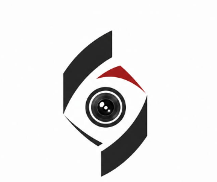

# PRAHARI

**A EYE THAT SEES EVERYTHING AND EVERYTIME**

**Unified Surveillance Intelligence Platform for Gujarat Police**

Built by [Sumit Nawale](https://www.linkedin.com/in/sumit-nawale-25274638b)

---

[](LICENSE)
[](https://github.com/itzlucifa/PRAHARI-/actions/workflows/ci.yml)
[](https://www.python.org/)
[](https://react.dev/)
[](https://docs.docker.com/compose/)
[](https://github.com/itzlucifa/PRAHARI-)
[](CONTRIBUTING.md)
[](https://www.youtube.com/watch?v=_xu8fuoak5k)

---



<br>

### 🎥 Watch the Live Demo
[](https://www.youtube.com/watch?v=_xu8fuoak5k)

---

## Table of Contents

- [Overview](#overview)
- [Architecture](#architecture)
- [Key Features](#key-features)
- [Repository Structure](#repository-structure)
- [Quick Start](#quick-start)
- [API Endpoints](#api-endpoints)
- [Multi-Agent System](#multi-agent-system)
- [Documentation](#documentation)
- [Deployment](#deployment)
- [License](#license)
- [Author](#author)

---

## Overview

PRAHARI is a production-grade, vendor-agnostic surveillance intelligence platform that transforms 80,000+ isolated CCTV cameras into a single intelligent control room. It normalizes heterogeneous camera feeds, runs compute-gated AI inference, correlates events across cameras, and delivers actionable insights in real time.

The platform scales from 3 cameras to 80,000+ using the **same container images** — no rewrite, no migration.

**Tagline:** *A EYE THAT SEES EVERYTHING AND EVERYTIME*

---

## Architecture

PRAHARI follows a proven 4-layer architecture:

```
Camera → go2rtc → Adapters → MQTT → Fusion Service → Dashboard
                               ↓
                          Qdrant (ReID vectors)
                               ↓
                         PostgreSQL (events)
                               ↓
                    Multi-Agent System (Watcher, Detector,
                      Notifier, Investigator, Copilot)
```

| Layer | Purpose | Technologies |
|-------|---------|-------------|
| **UNIFY** | Normalize any vendor camera stream | go2rtc, ONVIF discovery |
| **PERCEIVE** | Run AI inference (compute-gated) | YOLOv8, EasyOCR, TorchReID, InsightFace, Audio Detection |
| **FUSE** | Correlate events across cameras | MQTT, FastAPI, Qdrant, PostgreSQL, Multi-Agent System |
| **ACT** | Control room dashboard + exports | React, TypeScript, WebSocket, MJPEG streaming |

---

## Key Features

- ✅ **Vendor-agnostic ingestion** — any RTSP/WebRTC camera
- ✅ **6 AI event types** — detection, ANPR, ReID, anomaly, face match, audio events
- ✅ **Multi-agent threat coordination** — 5 specialized AI agents (Watcher, Detector, Notifier, Investigator, Copilot)
- ✅ **Audio event detection** — gunshot, glass break, scream, loud bang via FFT spectral analysis
- ✅ **Cross-camera trajectory tracking** — person/vehicle tracking across multiple cameras with prediction
- ✅ **PostgreSQL persistence** — durable event storage with fallback
- ✅ **Zone editor** — polygon-based intrusion detection
- ✅ **AI chat assistant** — natural language querying with 8 tools
- ✅ **Threat verification** — confidence-based alert filtering
- ✅ **Semantic search** — vector similarity search via Qdrant
- ✅ **Real-time dashboard** — WebSocket alerts, live MJPEG camera grid, 9 tabs
- ✅ **Court-admissible exports** — SHA-256 hash chain
- ✅ **Privacy by design** — blur/unblur with audit trail
- ✅ **Compute-gated economics** — ~₹40/camera/month at 80K scale

---

## Repository Structure

```
prahari/
├── README.md                    # This file
├── VISION.md                    # Complete technical brain (437 lines)
├── CHANGELOG.md                 # Version history
├── brain.md                     # Development roadmap & notes
├── LICENSE                      # Custom open-use license
├── docker-compose.yml           # Service orchestration
├── .gitignore
├── requirements.txt
├── install.bat / install.sh     # One-click installers
├── SECURITY.md
├── CONTRIBUTING.md
│
├── config/                      # Runtime configuration
│   ├── camera-registry.json     # Cameras + zones
│   ├── go2rtc.yaml
│   └── mosquitto.conf
│
├── shared/                      # Shared library
│   ├── events.py                # Canonical DetectionEvent schema
│   ├── adapter_base.py          # BaseAdapter ABC
│   ├── event_bus.py             # Local MQTT-like event bus
│   ├── adapters/
│   │   └── audio_detector.py    # FFT-based AudioEventDetector
│   └── agents/
│       ├── __init__.py
│       └── coordinator.py       # 5-agent coordination system
│
├── services/                    # Python microservices
│   ├── fusion-service/          # FastAPI REST + WebSocket + DB
│   │   ├── app.py               # Main API (1486 lines)
│   │   ├── database.py          # SQLAlchemy models
│   │   ├── run.py               # PYTHONPATH wrapper
│   │   └── requirements.txt
│   ├── adapter_detection/       # YOLOv8 detection
│   ├── adapter_anpr/            # Indian ANPR (YOLO + EasyOCR)
│   ├── adapter_reid/            # Cross-camera ReID
│   ├── adapter_anomaly/         # Loitering/crowd/audio detection
│   ├── adapter_face/            # InsightFace watchlist
│   ├── api-gateway/             # API gateway
│   ├── case-file/               # Evidence export
│   ├── privacy/                 # Blur/unblur audit
│   ├── onvif-discovery/         # Camera discovery
│   └── __init__.py
│
├── dashboard/                   # React + TypeScript frontend
│   ├── src/
│   │   ├── App.tsx              # 9-tab dashboard with live camera grid
│   │   ├── main.tsx
│   │   ├── types.ts
│   │   └── components/
│   └── public/
│       └── prahari-logo.png
│
├── scripts/                     # Operational scripts
│   ├── demo_event_injector.py   # Real-time demo event generator
│   ├── demo_launcher.py         # Interactive demo orchestrator
│   ├── local_mqtt_broker.py     # Local MQTT broker
│   ├── live_demo.py             # Live camera demo
│   ├── optimize_onnx.py         # ONNX model optimizer
│   └── start_demo.bat / .sh
│
├── models/                      # Model weights (gitignored)
├── test_feeds/                  # Sample videos (gitignored)
├── tests/                       # Test suite
├── tools/                       # go2rtc binary
├── docs/                        # Documentation
│   ├── ARCHITECTURE.md
│   ├── DEVELOPER_GUIDE.md
│   ├── SERVICE_REFERENCE.md
│   ├── DEPLOYMENT.md
│   └── scale-one-pager.md
└── .github/                     # CI/CD + templates
    ├── workflows/
    │   └── ci.yml               # TypeScript + Python linting
    └── ISSUE_TEMPLATE/
```

---

## Quick Start

### Docker (Recommended)
```bash
docker compose up --build
# Dashboard: http://localhost:5173
# API:       http://localhost:8000/docs
```

### Local Development
```bash
# Terminal 1 — MQTT Broker
cd scripts && python local_mqtt_broker.py

# Terminal 2 — Fusion Service
cd services/fusion-service && python run.py

# Terminal 3 — Dashboard
cd dashboard && npm install && npm run dev

# Terminal 4 — Demo Events
python scripts/demo_event_injector.py --realtime
```

### Verification
```bash
# Health check
curl http://localhost:8000/health

# Dashboard
# http://localhost:5173
```

---

## API Endpoints

| Method | Path | Description |
|--------|------|-------------|
| `GET` | `/health` | Health check |
| `GET` | `/events?limit=50` | Recent events |
| `POST` | `/events` | Ingest event |
| `GET` | `/cameras` | List cameras |
| `POST` | `/cameras` | Register camera |
| `GET` | `/alerts?limit=50` | List alerts |
| `GET` | `/zones` | List polygon zones |
| `POST` | `/zones/check-intrusion` | Intrusion detection |
| `POST` | `/chat/query` | AI chat assistant (8 tools) |
| `POST` | `/verify/threat` | Threat verification |
| `POST` | `/search/semantic` | Vector search |
| `POST` | `/search/events` | Advanced event search |
| `POST` | `/search/forensic` | Forensic search |
| `POST` | `/search/suspect` | Suspect search |
| `GET` | `/trajectory/{track_id}` | Cross-camera trajectory |
| `GET` | `/trajectory/search` | Trajectory search |
| `GET` | `/trajectory/predict/{track_id}` | Trajectory prediction |
| `POST` | `/trajectory/link` | Link trajectories |
| `POST` | `/audio/analyze` | Audio event analysis |
| `GET` | `/stream/mjpeg/{camera_id}` | MJPEG video stream |
| `GET` | `/stream/test_feed/{camera_id}` | Test video feed |
| `POST` | `/incidents/{incident_id}/export` | Export incident (SHA-256) |
| `GET` | `/agent/alerts` | Agent-generated alerts |
| `GET` | `/agent/incidents` | Agent-generated incidents |
| `GET` | `/agent/events` | Agent coordination events |
| `WS` | `/ws/alerts` | Real-time alerts |

---

## Multi-Agent System

PRAHARI's fusion service includes a 5-agent threat coordination system:

| Agent | Role |
|-------|------|
| **Watcher** | Monitors event streams, detects anomalies |
| **Detector** | Classifies threats, assigns confidence scores |
| **Notifier** | Generates and escalates alerts |
| **Investigator** | Tracks entities across cameras, builds trajectories |
| **Copilot** | Natural language chat interface, 8 tools for querying |

The AI Chat Assistant (`/chat/query`) supports natural language queries for tracking, threats, events, cameras, ANPR plates, and scene descriptions.

---

## Documentation

| Document | Description |
|----------|-------------|
| [VISION.md](VISION.md) | Complete technical brain (437 lines) |
| [brain.md](brain.md) | Development roadmap & implementation notes |
| [ARCHITECTURE.md](docs/ARCHITECTURE.md) | 4-layer architecture guide |
| [DEVELOPER_GUIDE.md](docs/DEVELOPER_GUIDE.md) | Setup + coding standards |
| [SERVICE_REFERENCE.md](docs/SERVICE_REFERENCE.md) | API + service reference |
| [DEPLOYMENT.md](docs/DEPLOYMENT.md) | Docker + production guide |
| [scale-one-pager.md](docs/scale-one-pager.md) | Scale economics summary |

---

## Deployment

- **Pilot:** Single district, 50 cameras, 2 engineers, 4-6 weeks
- **Scaling:** Same containers from 3 cameras to 80,000
- **Cost:** ~₹40/camera/month at 80K scale

See [DEPLOYMENT.md](docs/DEPLOYMENT.md) for details.

---

## License

Copyright (c) 2026 Sumit Nawale

PRAHARI is licensed under a custom open-use license. You are free to use, modify, and distribute this software with attribution. See [LICENSE](LICENSE) for full terms.

---

## Author

**Sumit Nawale**  
[LinkedIn](https://www.linkedin.com/in/sumit-nawale-25274638b) | [GitHub](https://github.com/itzlucifa) | [YouTube Demo](https://www.youtube.com/watch?v=_xu8fuoak5k)

*Technology should serve justice — not the other way around.*