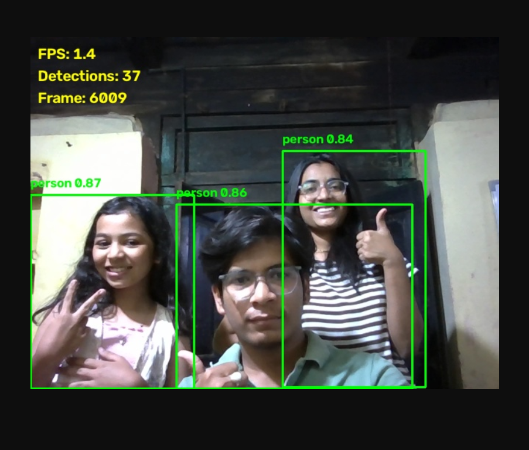

# PRAHARI

**Unified Surveillance Intelligence Platform for Gujarat Police**

Built by Sumit Nawale

### Live Demonstration




## Overview

PRAHARI is a production-grade, vendor-agnostic surveillance intelligence platform that unifies heterogeneous camera feeds, runs compute-gated AI inference, correlates events across cameras, and delivers actionable insights to control rooms in real time.

The platform is designed to scale from a single district to 80,000+ cameras while maintaining the same operational stack.

## Architecture

PRAHARI follows a 4-layer architecture:

1. **UNIFY** — Normalize any vendor camera stream (RTSP/WebRTC) via go2rtc
2. **PERCEIVE** — Run AI inference with compute-gated adapters:
   - YOLOv8 detection
   - Indian ANPR
   - TorchReID cross-camera matching
   - InsightFace watchlist matching
   - Rule-based anomaly detection
3. **FUSE** — Correlate events through MQTT event bus and Qdrant vector database
4. **ACT** — Control room dashboard, alerts, case file exports, privacy controls

## Repository Structure

```
prahari/
├── docker-compose.yml          # Full stack orchestration
├── requirements.txt            # Python dependencies
├── README.md                   # This file
├── VISION.md                   # Strategic roadmap
│
├── dashboard/                  # React + Vite + TypeScript frontend
│   ├── src/App.tsx
│   └── package.json
│
├── services/                   # Python microservices
│   ├── fusion-service/         # FastAPI REST + WebSocket
│   ├── adapter_detection/      # YOLOv8 detection
│   ├── adapter_anpr/           # License plate recognition
│   ├── adapter_reid/           # Cross-camera ReID
│   ├── adapter_anomaly/        # Loitering / crowd / running
│   ├── adapter_face/           # Face watchlist matching
│   ├── api-gateway/            # API gateway
│   ├── case-file/              # Evidence export
│   ├── privacy/                # Blur / unblur controls
│   └── onvif-discovery/        # Camera discovery
│
├── shared/                     # Canonical schema + base adapter
│   ├── events.py
│   └── adapter_base.py
│
├── scripts/                    # Operational scripts
│   ├── start_all.bat
│   ├── start_demo.bat
│   ├── demo_event_injector.py
│   ├── local_mqtt_broker.py
│   └── ...
│
├── models/                     # Model weights
│   └── yolov8n.pt
│
├── test_feeds/                 # Sample video files
│   ├── camera01.mp4
│   ├── camera02.mp4
│   └── camera03.mp4
│
├── tests/                      # Test suite
│   ├── test_e2e_pipeline.py
│   ├── test_final_audit.py
│   └── ...
│
├── tools/                      # go2rtc binary
├── config/                     # Runtime configs
└── docs/                       # Documentation
    ├── ARCHITECTURE.md
    ├── DEVELOPER_GUIDE.md
    ├── SERVICE_REFERENCE.md
    ├── DEPLOYMENT.md
    ├── DEMO_PLAN.md
    └── scale-one-pager.md
```

## Quick Start

```bash
# Start fusion service
cd services/fusion-service
set PYTHONPATH=C:\hackethon\prahari
python -m uvicorn app:app --host 0.0.0.0 --port 8000

# Start dashboard (new terminal)
cd dashboard
npm install
npm run dev

# Open browser
http://localhost:5173
```

## Key Features

- **Vendor-agnostic ingestion** via go2rtc
- **5 AI event types**: detection, ANPR, ReID, anomaly, face match
- **Real-time dashboard** with WebSocket alerts
- **Court-admissible exports** with SHA-256 hash chain
- **Privacy-by-design** with audited blur/unblur
- **Compute-gated cost model** (~₹40/camera/month at 80K scale)

## Documentation

- [Architecture](docs/ARCHITECTURE.md)
- [Developer Guide](docs/DEVELOPER_GUIDE.md)
- [Service Reference](docs/SERVICE_REFERENCE.md)
- [Deployment](docs/DEPLOYMENT.md)
- [Vision & Roadmap](VISION.md)

## License

Copyright (c) 2026 Sumit Nawale

Licensed under the PRAHARI Open Use License.

You are free to use, modify, and distribute this software with attribution.

**Author:** Sumit Nawale  
**LinkedIn:** https://www.linkedin.com/in/sumit-nawale-25274638b  
**Repository:** https://github.com/itzlucifa/PRAHARI-

See [LICENSE](LICENSE) for full terms.